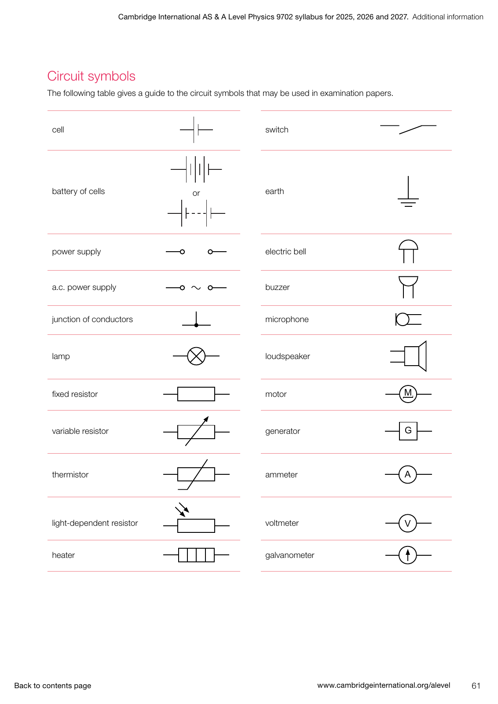
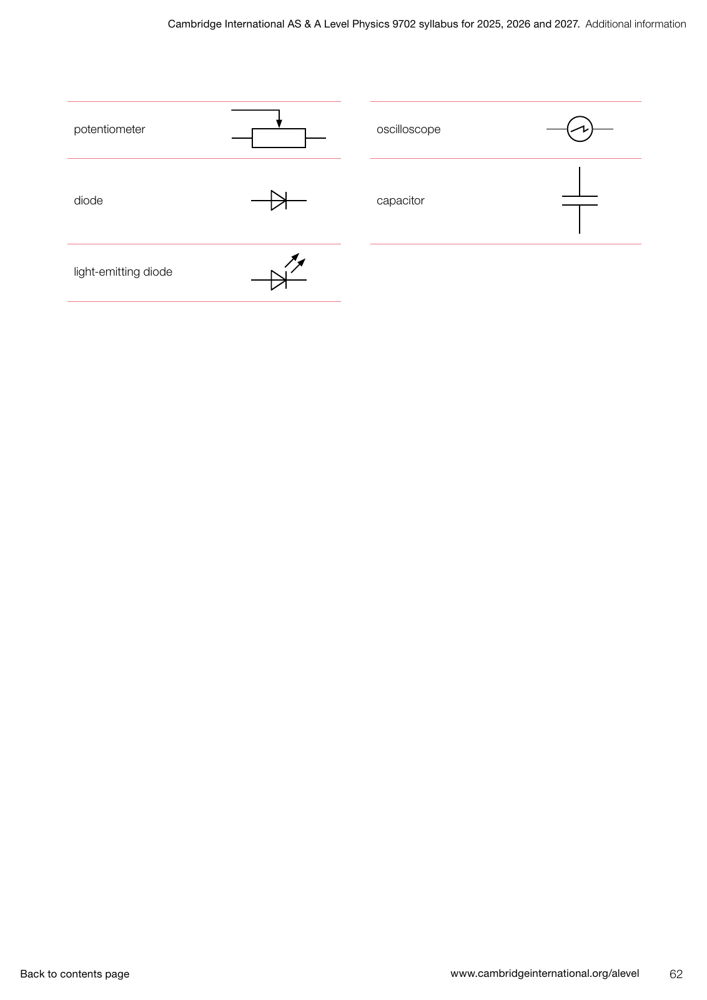

# Topic 10 — D.C. circuits

Cambridge International AS Level Physics 9702, 2025–2027 syllabus, version 1, printed page 24 (16 objectives). Circuit symbols: section 6, printed pages 61–62. These notes accompany the question bank; practise drawing circuits on paper as well as answering its text questions.

## 10.1 Practical circuits

### Symbols and diagrams — 10.1.1–10.1.2

Use the exact syllabus symbols below. The first sheet contains the cell, battery, power supply, a.c. supply, conductor junction, lamp, fixed resistor, variable resistor, thermistor, LDR, heater, switch, earth, electric bell, buzzer, microphone, loudspeaker, motor, generator, ammeter, voltmeter and galvanometer. The second adds the potentiometer, diode, LED, oscilloscope and capacitor. Recognition of a symbol does not introduce A Level capacitor or a.c. theory into this topic.

A filled junction dot joins wires electrically. Draw connections clearly and label component values and polarities. The long cell plate is positive. A closed switch completes its path; an open switch breaks that path. Series components lie along one unbranched path. Parallel components connect across the same two nodes, even if drawn in different places.

Draw an ammeter in series with the branch being measured. Its ideal resistance is zero. Draw a voltmeter across the two nodes whose potential difference is required; its ideal resistance is infinite, so it draws no current. An ideal ammeter across a supply would short it. For drawing practice, sketch a cell and switch supplying two parallel resistors, put an ammeter in just one branch and a voltmeter across the pair. Identify every junction and trace the complete current paths.

### E.m.f., p.d. and internal resistance — 10.1.3–10.1.5

E.m.f. is the energy transferred by a source per unit charge in driving charge around a complete circuit. It is measured in volts, not newtons. Potential difference across a resistor is the electrical energy transferred to other forms per unit charge. A source can convert chemical energy into electrical energy; resistors transfer electrical energy to thermal energy.

Model a real source as ideal e.m.f. E in series with internal resistance r. When it supplies current I, the internal drop is Ir, so its terminal p.d. is E − Ir. Increasing current reduces terminal p.d. if E and r remain constant. At open circuit I = 0, so the ideal voltmeter reading equals E. These statements use a discharging source; do not apply the same sign blindly to charging.

Example: E = 12 V, r = 1 Ω and external R = 5 Ω give I = 2 A and terminal V = 10 V. The source supplies 24 W: 4 W is dissipated internally and 20 W in the load.

## 10.2 Kirchhoff’s laws

### Conservation and circuit equations — 10.2.1–10.2.2, 10.2.7

The first law states that total current entering a junction equals total current leaving it. It follows from conservation of charge: charge does not accumulate at a steady junction. Current divides between branches and recombines; it is not consumed by resistors.

The second law states that the algebraic sum of potential changes around a closed loop is zero. Equivalently, total e.m.f. rises equal total potential drops for a consistently chosen loop direction. This follows from conservation of energy per unit charge. Going through a source from negative to positive is a rise; going through a resistor in the assumed current direction is a drop IR. A negative solved current means the actual current is opposite to the assumed arrow.

To solve a circuit, label nodes, assume branch-current directions, write independent junction and loop equations, solve together, and check both laws. Components in parallel share p.d., not generally current. Example: an 18 V ideal source supplies 2 Ω in series with 6 Ω and 12 Ω in parallel. The parallel equivalent is 4 Ω, total current is 3 A, and the parallel p.d. is 12 V. Branch currents are 2 A and 1 A; they add to 3 A.

### Resistance combinations and their derivations — 10.2.3–10.2.6

In series, current I is common. The loop law gives V = V1 + V2 + … = IR1 + IR2 + … = I(R1 + R2 + …). Comparing with V = IR_total and dividing by nonzero I gives R_total = R1 + R2 + … . It exceeds any one positive component resistance.

In parallel, p.d. V is common. The junction law gives I = I1 + I2 + … = V/R1 + V/R2 + … . Comparing with I = V/R_total and dividing by nonzero V gives 1/R_total = 1/R1 + 1/R2 + … . For two resistors, rearrange to R_total = R1R2/(R1 + R2). The equivalent is smaller than the smallest branch resistance. These formulas require the stated series/parallel connections; visual position alone is insufficient.

## 10.3 Potential dividers

### Unloaded and loaded output — 10.3.1

Connect R_upper between +V_s and junction J, and R_lower between J and 0 V. Define output as the potential of J relative to 0 V. With no output load, the same current flows through both resistors and V_out = V_s R_lower/(R_upper + R_lower). A high-resistance voltmeter approximates this unloaded condition.

A load across J and 0 V is in parallel with R_lower. Replace that lower branch by its parallel equivalent before using the divider ratio. This is a derived application of Kirchhoff’s laws. For example, a 12 V supply and two 1 kΩ divider resistors give 6 V unloaded. Adding a 1 kΩ load across the lower resistor gives a lower equivalent of 0.5 kΩ and output 4 V. The original unloaded ratio no longer applies.

### Potentiometer comparisons and null measurements — 10.3.2–10.3.3

A steady driver current through a uniform wire creates a constant potential gradient. Connect the p.d. under comparison in opposition to the p.d. between the zero end and a movable contact, using a galvanometer in the comparison branch. Adjust the contact until the galvanometer reads zero. At null the two opposed p.d.s are equal and there is no comparison-branch current. The driver wire still carries current.

For unchanged wire current, p.d. is proportional to balance length: V1/V2 = L1/L2. Measure both lengths from the same reference end; the whole-wire length is not the balance length unless the contact is at the far end. A 1.5 V reference balancing at 30 cm and an unknown balancing at 50 cm give an unknown of 2.5 V. The driver must provide enough p.d. along the available wire to obtain a balance. A cell measured at null supplies no comparison current, so there is no internal Ir drop due to that measurement; with no other load, its e.m.f. is measured.

### Sensor dividers — 10.3.4

For an LDR, increasing light intensity decreases resistance. For a negative-temperature-coefficient thermistor, increasing temperature decreases resistance. The response is not assumed linear. Determine the sensor-resistance change first, then use its position in the divider to determine the output change. Keep supply voltage and the other resistance fixed.

| Change | Sensor position | Output J relative to 0 V |
|---|---|---|
| More light or higher temperature: sensor R falls | Upper | Rises |
| More light or higher temperature: sensor R falls | Lower | Falls |
| Less light or lower temperature: sensor R rises | Upper | Falls |
| Less light or lower temperature: sensor R rises | Lower | Rises |

## Formula sheet

All resistance symbols (R, r, R1, R2, R_total, R_upper, R_lower, R_L and R_b) have SI unit ohm (Ω). All current symbols (I, I1, I2, I_in, I_out) have unit ampere (A). E, V, V_s, V_out, V1 and V2 are e.m.f.s or p.d.s in volts (V), as identified below. Subscripts label components or measurement states, not new units.

| Formula | Meanings and conditions |
|---|---|
| E = W_source/Q | E: source e.m.f.; W_source: energy supplied by source (J); Q: charge circulated (C). Definition. |
| V = W_component/Q | V: component p.d.; W_component: electrical energy transferred (J); Q: charge (C). Topic 9 definition used here. |
| V = IR | V across resistance R carrying I; use the appropriate operating resistance. Topic 9 relation. |
| V = E − Ir; E = V + Ir | V: terminal p.d.; E: source e.m.f.; r: internal resistance; I: current supplied by the discharging source. |
| I = E/(R + r) | One external equivalent resistance R in series with internal r; ideal connecting wires. Derived. |
| r = (E − V)/I | E from open circuit and V at nonzero loaded current I; assume E and r unchanged. Derived. |
| ΣI_in = ΣI_out | Sums of currents entering/leaving a steady junction; conservation of charge. |
| ΣΔV = 0 | Signed potential changes ΔV (V) round a closed loop; consistent traversal direction. Equivalent to signed source rises equalling resistor drops. |
| R_total = R1 + R2 + … | Series resistances; common current. |
| 1/R_total = 1/R1 + 1/R2 + … | Parallel resistances; common p.d. |
| R_total = R1R2/(R1 + R2) | Exactly two parallel resistors; derived from the reciprocal sum. |
| V_out = V_s R_lower/(R_upper + R_lower) | Ideal fixed supply V_s; output across lower resistor, unloaded. |
| R_b = R_lower R_L/(R_lower + R_L); V_out = V_s R_b/(R_upper + R_b) | Load R_L across lower resistor; R_b: lower equivalent. Derived loaded-divider result. |
| V = kL; k = V_wire/L_wire | Uniform potentiometer wire at steady current. k: potential gradient (V m⁻¹); L: balance length (m); V: p.d. over L; V_wire and L_wire: p.d. and length of the uniform driven section. |
| V1/V2 = L1/L2 | Two balances with the same gradient; L1, L2 in m (or matching length units in the ratio); compared p.d.s V1, V2. |
| P_source = EI; P_internal = I²r; P_load = VI | Powers in watts (W); source supplying I, terminal p.d. V, internal r. Derived energy check from Topic 9 power relations; P_source = P_internal + P_load. |

1 kΩ = 1000 Ω and 1 cm = 0.01 m. Matching resistance units cancel in a divider ratio, but use Ω for calculations with A and V. Keep intermediate precision and round the final answer appropriately.

Common mistakes: calling e.m.f. a force; using terminal V/I as internal resistance; assuming parallel branch currents are equal for unequal resistors; adding parallel resistances directly; confusing a null comparison current with zero driver current; and predicting a sensor output without specifying where the sensor sits.

Source: [supplied Cambridge syllabus](C:/Users/USER/Downloads/664565-2025-2027-syllabus.pdf). The two symbol images are renders of its printed pages 61–62. [Checked objectives and source hash](../../lib/as-physics-syllabus.json). [Topic verification](../as-physics-circuits-verification.md).
